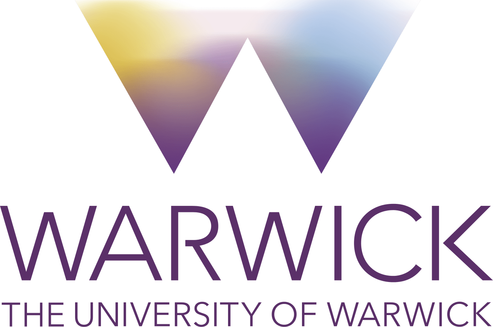

```{r setup, include=FALSE}
knitr::opts_chunk$set(echo = TRUE)
```

***

## Github Link:
https://github.com/Harris-Go/EC349/blob/ac90b30a5040d84735a9059b4d77c930439d9011/ProblemSet2.Rmd

***

># 1.  Write your name and surname in bold font, with your Name ONLY in italics.

#### **Answer:**

***Harris* Goodman**

># 2.  Print your student number and what year you are in on different lines.

#### **Answer:**

2101274

3

># 3.  Briefly state, in italics, why you are doing this Data Science Module

#### **Answer:**

*I really enjoy using computational methods to solve problems using data and I am keen to learn and utilise the basic techniques of data science.*

># 4.  Make an unordered list of at least 3 things you have learned in this module.

#### **Answer:**

+ Data Science Methodologies
+ Integrating R and Github
+ Data types in R

># 5.  Create a table showing the 1st 5 stages of the John Rollins General Data Science Methodology and the quetions associate with them.

#### **Answer:**

Stage | Questions
----- | ---------
Business/Problem Understanding | What problem/question are you trying to solve/answer?
Analytic Approach | How can you use data to answer this question?
Data Requirements | What data is needed to answer the question?
Data Collection | What is the source of the data? How will you collect and receive it?
Data Understanding | Is the data indicative of the problem to be solved?

># 6.  Create an ordered list of at least 3 other Data Science methodologies.

#### **Answer:**

1. CRISP-DM (Cross-Industry Standard Process for Data Mining)
2. TDSP (Team Data Science Process)
3. OSEMN (Obtain. Scrub. Explore. Model. Interpret)

># 7.  Provide and ordered list the weaknesses of the CRISP-DM methodology and how to address them

#### **Answer:**

1. Outdated
    + Add phases (if needed)
2. Documentation heavy
    + Document enough...but not too much
3. Not a project management approach
    + Define team roles
    + Combine with a team coordination process
4. Can ignore stakeholders
    + Ensure actionable insight
5. Slow start
    + Iterate quickly

># 8.  Download and include a University of Warwick Logo in your document.

#### **Answer:**

{width=50%}

># 9.  Write and execute a code to randomly generate 10 numbers from a normal distribution with mean 12 and standard deviation 3.

#### **Answer:**

```{R}
rnorm(10, mean = 12, sd = 3)
```

># 10. Write and execute a code to calculate the mean of 12 random numbers generated from the intervalof integes from 5 to 25.

#### **Answer:**

```{R}
a <- sample(5:25, 12)

mean(a)
```

># 11. Write and execute a code to create a scatter plot containing 12 points whose coordinates were randomly geenrated in the interval 5 to 25. Provide a title for the figure, label the x and y axis.

#### **Answer:**

```{R}
x <- sample(5:25, 12)
y <- sample(5:25, 12)

plot(x, y,
     main = "Scatterplot with randomly generated values",
     xlab = "X-Values",
     ylab = "Y-Values")
```

># 12. Write and execute a code to create a function to calculate standard error. Then, calculate the standard error of a set of 15 randomly generated numbers from a normal distribution with mean 12 and standard deviation 3.

#### **Answer:**

```{R}

standard_error <- function(numbs){
  
  sd(numbs)/sqrt(length(numbs))
  
}

b <- rnorm(15, mean = 12, sd = 3)

standard_error(b)


library(plotrix)
std.error(b)

```

># 13. Given that BMI=kg/m2, where kg is the person’s weight in kilograms and m2is height in meters squared, write and execute a code to create a function that calculates the BMI of who weighs 85kg and is 1.9m tall.

#### **Answer:**

```{R}
BMI <- function(kg,m){
  
  kg/(m^2)
  
}

BMI(85,1.9)
```